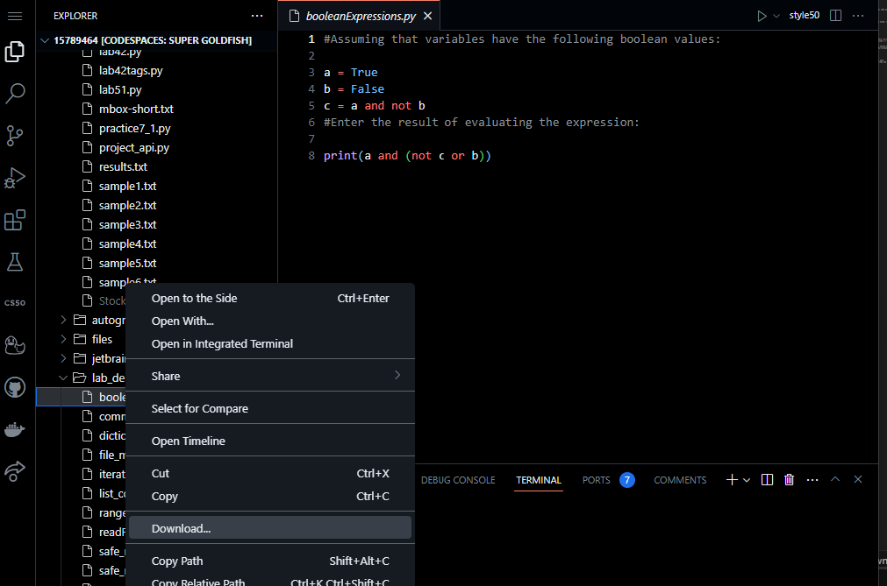

# Programming Problem 1: Input, Processing, Output

> The purpose of this assignment is to test your understanding and application of the concepts discussed in **Week 1**:
>
> - obtain user input
> - perform calculations and
> - produce valid output

## Specifications

Write a program to prompt the user to input hours worked and rate per hour. Compute and display the amount to pay.

To start the assignment type in the terminal:
```
code assignment1.py
```


*Remember*: You should use input to read a string and float() to convert the string to a number. Do not worry about error checking or bad user data at this point.

## Execute and Test your program

*Remember*: in order to execute your code you type in the terminal:
```
python assignment1.py
```

Use the following test data to make sure your program produces correct resutls.

Enter hours worked: 35

Enter rate per hour: 2.75

96.25

If you want you can test your program with different inputs!


## Check Your Code

Execute the below to evaluate the correctness of your code using `check50`, but be sure to test it yourself before that...
Login with your `GitHub username` and `Personal Access Token` when prompted. For security, you'll see asterisks (`*`) instead of the actual characters in your token.

If you do not have generated a Personal Access ToKen follow the instructions:
https://docs.github.com/en/authentication/keeping-your-account-and-data-secure/creating-a-personal-access-token

```
check50 mkotsovoulou/ods6001a/main/assignments/assignment1
```

## Submit your code

When you are happy with your solution, download the code and upload it to Blackbaord.



# Done!
:tada:
