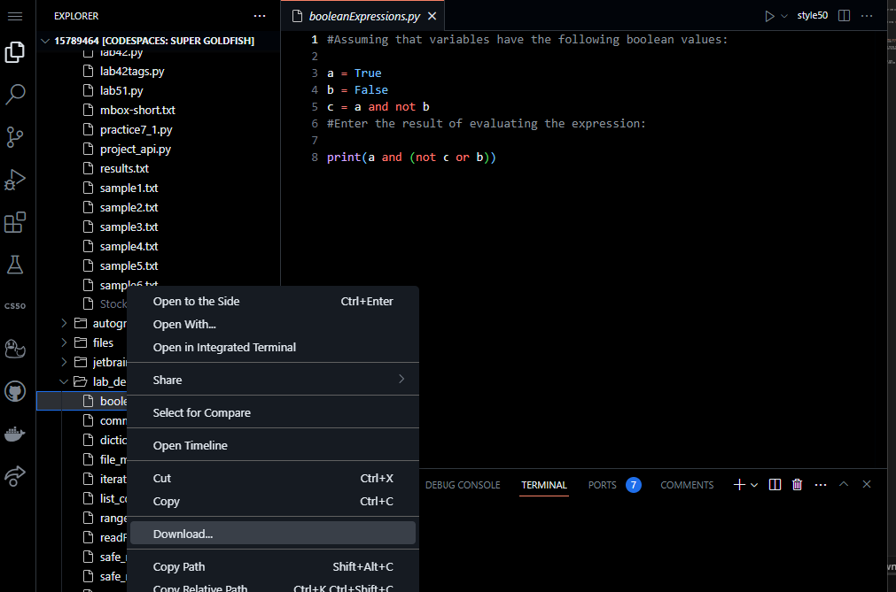

# Programming Problem 7: OOP

> The purpose of this assignment is to test your understanding and application of the concepts discussed up to **week 6**:
>
> - implement object classes and develop program to use them
> - test, debug and predict program behaviour

## Specifications
#### In assignment7.py, BankAccount class

1. Complete the add_interest method to increase the balance by applying the annual interest

#### In assignment7.py, MAIN PROGRAM
2. Open account.txt to read

3. For each line in accounts.txt
   - Split using the comma and strip the empty characters
   - Create a BankAccount object with the owner and balance in the line
   - and add it in the BankAccounts list

4. Modify the annual interest (class variable) to 3%

5. Call the add interest method on all Bank Accounts

6. Calculate the sum of all balances in the list and print it


To start the assignment type in the terminal:
```
code assignment7.py
```

## Execute and Test your program

*Remember*: in order to execute your code you type in the terminal:

```
python assignment7.py
```
The sum of all balances after the interest is applied should be 2346.0

## Check Your Code

```
check50 mkotsovoulou/ods6001a/main/assignments/assignment7
```

## Submit your code

When you are happy with your solution, download the code and upload it to Blackboard.




# Done!
:tada:
